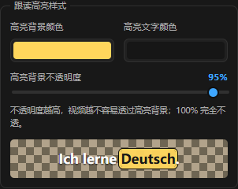
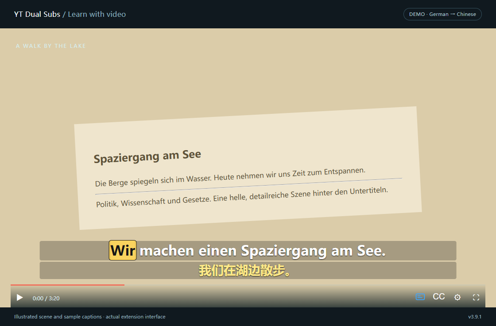

<p align="center">
  
</p>

<h1 align="center">YT Dual Subs</h1>

<p align="center"><strong>Learn languages from the videos you already watch.</strong><br />
Original captions, translations, word lookup, and sentence practice — right on YouTube and Bilibili.</p>

<p align="center">
  <a href="https://github.com/aolingge/yt-dual-subs/archive/refs/heads/main.zip">Download current source</a> ·
  <a href="#install">Install</a> ·
  <a href="README.zh-CN.md">中文说明</a> ·
  <a href="https://github.com/aolingge/yt-dual-subs/issues">Report an issue</a>
</p>

<p align="center">
  
  <a href="LICENSE"></a>
  
  
</p>


*Example UI captured from v3.8.1, retained to illustrate the interface rather than the current source version. A video needs available YouTube captions; translation availability depends on the provider.*

## Make every caption useful

| When you want to… | YT Dual Subs helps you… |
| --- | --- |
| Follow a video in another language | Read the original and translation together in one organized overlay. German, English, Spanish, Japanese, Arabic, and other caption languages use the same workflow. |
| Understand an unfamiliar word | Hover over a word for a translation. German words also have a **German Assistant** dictionary link. Drag to select and copy either subtitle line. |
| Train your listening | Hide the translation, reveal it on hover or by shortcut, and replay a sentence at a slower speed. |
| Remember a useful phrase | Search the transcript, jump to a sentence, save it, and review it later with the translation hidden. |
| Keep the picture comfortable | Move the box, drag either edge to adjust its width, and set each line's font, color, and background. Layout adapts to smaller players and fullscreen. |
| Take your study material with you | Export original, translated, or bilingual SRT files, and back up saved sentences as JSON. |
| Learn German from Chinese videos | On Bilibili, read the German translation above the Chinese original, with your own subtitle file when a video has no caption track. |

**Free to use · Open source · No extension account · No API key required.**

## Bilibili: Chinese videos with German subtitles

On a [Bilibili](https://www.bilibili.com) video page the extension shows the
**German translation on the top line** and the **Chinese original on the bottom
line**, both from the same caption segment and both following the video clock.
Your YouTube enable state, target language and line order are stored separately, so switching
Bilibili to German leaves them untouched.

Use **在 B 站启用双语字幕** in the popup's Bilibili card, or click the small
subtitle icon in the player's bottom-right control bar, to show or hide the
overlay. Both controls remember the same Bilibili-only setting. Existing
Bilibili installations restore German above Chinese once after this fix.

Bilibili's default here is Chinese → **German**, translation on top. This works
on ordinary submitted videos (`bilibili.com/video/…`), including multi-part
videos, web fullscreen and browser fullscreen. If a video has no readable
Chinese caption track — and visible Chinese burned into the picture does **not**
count as one — import a UTF-8 SRT file from the popup's **哔哩哔哩** card and it
is translated the same way.

Read the [Bilibili guide](docs/BILIBILI.md) for what is supported, what is not
(no live streaming, bangumi, mobile or OCR), how the captions are read, and what
each status message means.

### Look up a word without leaving the video

Pause the pointer on an original-caption word for about 0.4 seconds. The lookup card appears beside it; moving away closes it. Dictionary pages open only when you click their link. Word translations can be ambiguous, so keep the sentence context in mind.


### Turn watching into practice

1. Choose the original caption track in YouTube and your translation language in the extension.
2. Click **Use study preset** to keep the original visible, reveal translations on hover, and repeat at 0.75×.
3. Use **Repeat sentence**, **Previous**, and **Next** to practice a difficult line.
4. Save useful sentences, then review them with the translation hidden. Mark them learned when ready.

### Follow each word automatically

In **Study**, enable **Box the word being spoken**. The complete sentence stays visible while the highlight moves with the video clock, including after seeking or returning to a cached video. The extension automatically chooses the available timing source:

| Available caption data | What you see |
| --- | --- |
| Original track provides individual word times | Highlight follows those caption word times. |
| Original has sentence times; a same-language automatic track matches the whole sentence | The matched word times are used without changing your selected original text. |
| Original has sentence times; the automatic track matches only part of the sentence | The matched words keep their real times and the words between them are placed in order between those anchors. The video badge says **Partly matched**. |
| No reliable word match | **Approximate** progress, clearly labeled in the video: syllables, punctuation pauses and the pace measured from the captions around the current sentence. |
| No reliable word match, and the optional audio helper has measured the speech | Word times aligned to the audio for German and English, labeled in the video as audio-derived. |

**Word-time source** in **Study** chooses how far the extension may go:

| Mode | Behaviour |
| --- | --- |
| **Auto** (default) | Use the times the captions carry, match the same-language automatic track where it is reliable, and estimate the rest. |
| **Approximate follow-along** | Never request another caption track and never use the audio model; sentences without caption word times are estimated. |
| **Audio alignment** | As Auto, and also accept word times measured from the audio by the local helper. |

A sentence whose words come from more than one of these sources is never labelled as exact: matched words and estimated words are marked separately, and the popup reports the source of the sentence on screen. Even caption word times can be wrong, so no timing source is described as 100% accurate.

Approximate progress is enabled by default. Turn off **Use approximate progress when word times are missing** to require caption word timestamps; unmatched sentences then remain visible without a word highlight. The popup shows the source used for the current sentence. If a sentence was matched against the automatic track and you turn approximate progress off, that sentence is shown without a highlight rather than with a partly estimated one.

In **Study → Word highlight style**, adjust the background color, highlighted text color, and background opacity with a live preview. The default is a 95% opaque gold background with dark text; at 100%, the video does not show through the highlighted background.





*Actual v3.9.1 interface using controlled caption timestamps and a demo video. This illustrates the feature, not measured alignment to German speech.*

This works across supported caption languages and needs no API key or setup per video. The normal subtitle path requires usable captions. Even automatic-caption timestamps can be imperfect; approximate progress is a reading aid, not precise speech alignment. For videos confirmed to have no readable caption track, optional on-device speech recognition can generate captions after an explicit start.

When no reliable caption word times exist, **Audio-aligned highlighting** can measure them from the video's audio instead. Choose it in the popup's study card to open its own page, which reports what is already cached and what remains. It uses a separate local helper that you start yourself and supports German and English; the first analysis downloads a model (about 360 MB per language) and later videos reuse it. Results stay on your computer, so reopening a video keeps the highlight, and measured times are labeled in the video. A stored result belongs to the exact track, sentence and audio it was measured from, so editing the captions, replacing an imported audio file or changing its start time means those sentences are measured again rather than reused. Caption word times always win over measured ones. Setup and limits: [docs/AUDIO_ALIGNMENT.md](docs/AUDIO_ALIGNMENT.md).

<table>
  <tr>
    <td align="center"><strong>Search, jump, and save</strong></td>
    <td align="center"><strong>Make the layout yours</strong></td>
  </tr>
  <tr>
    <td></td>
    <td valign="top"></td>
  </tr>
</table>

## Install

For **desktop Chrome and Microsoft Edge**. Installation currently uses **Load unpacked**.

1. [Download the current source ZIP](https://github.com/aolingge/yt-dual-subs/archive/refs/heads/main.zip) and extract it to a folder you will keep.
2. Open `edge://extensions` in Edge, or `chrome://extensions` in Chrome.
3. Turn on **Developer mode**, then click **Load unpacked**.
4. Select the extracted **yt-dual-subs-main** folder — the one containing `manifest.json`.
5. Open a YouTube video with captions — or a Bilibili video with Chinese captions. On YouTube the extension normally turns CC on for you; you can disable that option; on Bilibili it uses the caption track the player already loaded.
6. Pin the toolbar icon, open its popup, and choose your target language. The popup follows the tab it is opened over, so Bilibili and YouTube keep their own language and line order.

**Updating:** replace the extension files in the same folder, reload its card on the extensions page, then **refresh existing YouTube and Bilibili tabs**. Saved sentences stay in extension-local storage; [export a JSON backup](#privacy-and-your-data) before uninstalling.

The current source is **3.12.6**. It preserves complete sentences and original punctuation, softens word highlighting, batches concurrent status reads and avoids rebuilding unchanged recognition transcripts. Stable study-card IDs and local translation-target validation from 3.12.5 remain included. These corrections do not guarantee lower WER on every recording; see the [accuracy evidence](docs/ACCURACY.md). Alignment uses port **8767**. Chromium **116 or later** is required. See [3.12.6 notes](docs/releases/v3.12.6.md), [performance review](docs/PERFORMANCE.md) and [integration choices](docs/INTEGRATIONS.md).

Browser references: [Edge sideloading guide](https://learn.microsoft.com/en-us/microsoft-edge/extensions/getting-started/extension-sideloading) · [Chrome unpacked extension guide](https://developer.chrome.com/docs/extensions/get-started/tutorial/hello-world#load-unpacked).

<details>
<summary>Prefer installing from source?</summary>

```sh
git clone https://github.com/aolingge/yt-dual-subs.git
```

Load the cloned folder using the same steps above. There is no build step or dependency installation. You can also [download the source ZIP](https://github.com/aolingge/yt-dual-subs/archive/refs/heads/main.zip).

</details>

## Choose how translations appear

**Want translations sooner?** Popup → **Translation → Engine → Fast display**.

| Mode | What it does |
| --- | --- |
| **Whole-sentence** — default | Prefers YouTube's translated track. If it is still pending after 0.35 seconds, Google prepares the current and next two sentences. |
| **Per-sentence** | Translates displayed sentences through Google. |
| **Fast display** | Starts Google for the current and next two sentences while YouTube's translated track loads. |

The original is displayed as soon as available and does not wait for translation. While the full track loads, visible native captions can be displayed and translated first in **any mode**. Loaded captions follow the video's clock; late translation responses are checked against the current sentence. Network delays and provider rate limits still affect when a new translation arrives.

On Bilibili there is no translated caption track like YouTube's, so **Fast display** has nothing to wait for and the translation always goes through the same Google text translation. The German and Chinese lines are still separate: the Chinese is shown as soon as it arrives, the current sentence is translated first, nearby sentences follow, and the Chinese stays visible if a translation is slow or fails.

The extension reuses complete captions already received by the player and retries transient loading failures automatically. In the native-caption fallback, growing text shares a translation queue; a translated prefix stays visible with **…** until the latest translation arrives. Pausing to wait also keeps translations loading.

The subtitle interface starts as soon as the player exists, without waiting for the whole page to finish parsing. Repeated startup/configuration messages share pending track requests. A YouTube translated-track rate limit pauses new translation requests for 20 seconds while original loading and Google fallback remain independent.

Target languages include the built-in list and **Other language code…**, for example `nl`, `tr`, `uk`, or `pt-BR`. This is a multilingual extension; it is not limited to German.

## Small controls, useful shortcuts

| Action | How |
| --- | --- |
| Show or hide the translated line | `Alt+Shift+Y` |
| Repeat the current sentence; press again to stop | `Alt+Shift+S` |
| Reveal translation in **On key** mode | `Alt+Shift+U` |
| Move the subtitle box | Drag its top-left handle; double-click to reset position. |
| Adjust box width | Drag either side grip, or use **Layout → Subtitle box width**. Double-click a grip to restore automatic width. |
| Adjust timing | **Layout → Sync offset**, up to ±2 seconds. Exported SRT timing stays unchanged. |
| Export captions | **Export subtitles**, choose original, translation, or bilingual. |
| Export to Anki | **Saved review → Export to Anki (TSV)**; see [the import guide](docs/ANKI.md). |

Shortcuts can be reassigned at `edge://extensions/shortcuts` or `chrome://extensions/shortcuts`. Repeat speeds include **0.75×, 0.6×, and 0.5×**; the normal playback rate returns when repeating stops.

## Frequently asked questions

<details>
<summary><strong>Why are no subtitles appearing?</strong></summary>

Confirm that the video has a caption track in YouTube's **CC / Settings → Subtitles** menu. Enable the extension and captions, then refresh the page — especially after an extension update. Check the popup's status line for loading, fallback, or rate-limit messages. If no readable track is confirmed, configure the optional local recognition service, check its connection, and start recognition manually.

On Bilibili, open the player's caption menu. If there is no Chinese entry, the video has no readable Chinese track and the popup says so; import an SRT file instead. Some tracks are offered only to signed-in viewers, and the popup says that too.

</details>

<details>
<summary><strong>Why is Bilibili asking me to sign in?</strong></summary>

Bilibili serves some caption tracks only to signed-in viewers. Sign in on Bilibili and refresh the page. The extension uses the page's ordinary session and does not work around login, membership or access restrictions, and it never reads or exports cookies.

</details>

<details>
<summary><strong>What if the original appears but the translation takes longer?</strong></summary>

Try **Fast display**. It prepares upcoming sentences while the video plays. A slow or rate-limited translation service can still delay results; the original stays independent of that wait. Repeated requests for the same text can use cached translations.

</details>

<details>
<summary><strong>Does it read subtitles burned into the video?</strong></summary>

No. It uses YouTube's caption data, Bilibili's caption data, or visible native-caption text. It never looks at the video pixels: there is no OCR, and captions embedded in the picture cannot be removed. On Bilibili, Chinese text painted into the picture is not a caption track — import an SRT file instead.

When a video has no caption track at all, **on-device speech recognition** can create one from the audio instead. It reads the tab's sound rather than the picture, runs through a bridge on your own computer with nothing uploaded, and must be started by hand per video. See [Speech recognition for videos without captions](docs/BILIBILI.md#speech-recognition-for-videos-without-captions).

</details>

<details>
<summary><strong>Why did changing colors or sliders cause a storage quota error?</strong></summary>

Older code wrote to browser sync storage for every input event. Version 3.9.1 applies and saves changes locally first, then merges sync writes at least 2.5 seconds apart. The last edit survives closing the popup. If sync is temporarily limited, local preferences stay usable and the background retries when active; cross-device sync still depends on your browser settings. After updating, clear the historical extension error and check whether it recurs.

</details>

<details>
<summary><strong>Does hover mean a word, or the whole translation line?</strong></summary>

They are separate features. **Word lookup** queries the word under the pointer. **Translation → On hover** in Study settings reveals the translated subtitle when the pointer is inside the player; it hides when the pointer leaves the player or browser window. You can disable word lookup independently.

</details>

<details>
<summary><strong>Why does bilingual SRT export sometimes stop?</strong></summary>

Translated and bilingual export checks for missing or misaligned spoken lines. If the translation is incomplete, it reports the problem instead of silently exporting an incomplete file. Original-only export remains available when source cues are loaded.

</details>

## Privacy and your data

- No extension analytics or tracking, and no extension account.
- Translation sends caption text to YouTube or Google; hover lookup sends the hovered word to Google. The Google endpoint is unofficial and may be rate-limited.
- On Bilibili the extension reads the caption data the page's own player already fetched, using the page's normal session for the site's own public endpoints. It never reads, copies or exports cookies, and adds no logic to get around a login, membership level or access restriction.
- An imported subtitle file is kept in extension-local storage on this computer and is not uploaded; only the text of the segments being translated is sent to the translation service.
- German Assistant receives the word only when you click the dictionary link.
- Settings are staged locally and then written to browser extension sync storage. **Saved sentences are local** and do not sync automatically; use **Export saved / Import saved** for backups and transfers. Uninstalling clears local extension data.

Read the [full privacy and permission details](docs/PRIVACY.md).

## Help improve it

Found a problem? [Open an issue](https://github.com/aolingge/yt-dual-subs/issues) with your browser and extension versions, caption language, translation mode, and steps to reproduce. Include a public video link if useful; omit personal information.

Contributions are welcome. The extension uses plain JavaScript/CSS with no build step. See the [development guide](docs/DEVELOPMENT.md) and [3.12.1 update notes](docs/releases/v3.12.1.md). If it helps your learning, a GitHub star makes the project easier for others to find.

## Credits and license

Based on [Gythiro/yt-dual-subs](https://github.com/Gythiro/yt-dual-subs), with multilingual study tools, word lookup, responsive layouts, resizable subtitles, and startup/synchronization improvements added in this repository. The original copyright notice is preserved.

Released under the [MIT License](LICENSE). This is an independent extension and is not affiliated with YouTube, Google, or German Assistant.

## 3.12.4 local recognition and review

The panel now offers registered local models, runtime device status, Chinese script conversion, per-language terminology, optional sentence context, manual corrections and cached segment retries. See the [Chinese usage guide](docs/RECOGNITION_SETTINGS.md). Reload the extension and restart the updated source bridge; an older installed executable is unchanged.
