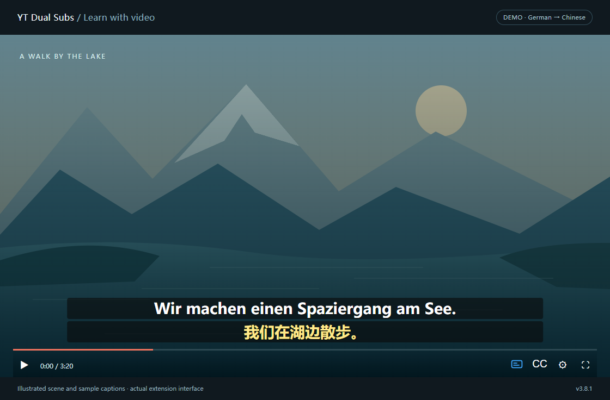
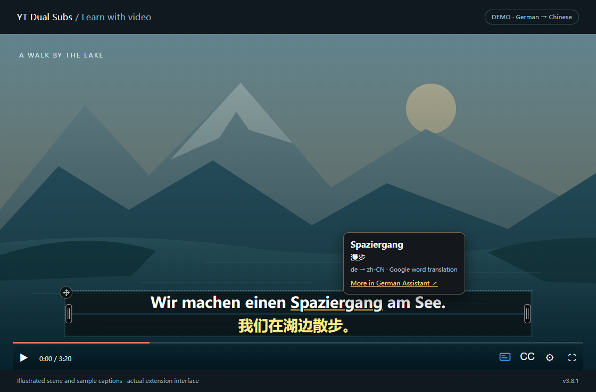
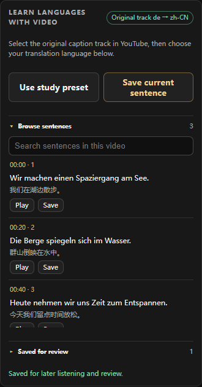
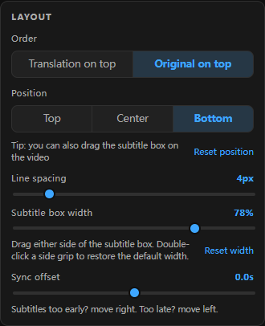

<p align="center">
  
</p>

<h1 align="center">YT Dual Subs</h1>

<p align="center"><strong>Learn languages from the videos you already watch.</strong><br />
Original captions, translations, word lookup, and sentence practice — right on YouTube.</p>

<p align="center">
  <a href="https://github.com/aolingge/yt-dual-subs/releases/latest">Download the latest version</a> ·
  <a href="#install">Install</a> ·
  <a href="README.zh-CN.md">中文说明</a> ·
  <a href="https://github.com/aolingge/yt-dual-subs/issues">Report an issue</a>
</p>

<p align="center">
  
  <a href="LICENSE"></a>
  
  
</p>



*Actual v3.8.1 extension interface with an illustrated demo scene and sample captions. A video needs available YouTube captions; translation availability depends on the provider.*

## Make every caption useful

| When you want to… | YT Dual Subs helps you… |
| --- | --- |
| Follow a video in another language | Read the original and translation together in one organized overlay. German, English, Spanish, Japanese, Arabic, and other caption languages use the same workflow. |
| Understand an unfamiliar word | Hover over a word for a translation. German words also have a **German Assistant** dictionary link. Drag to select and copy either subtitle line. |
| Train your listening | Hide the translation, reveal it on hover or by shortcut, and replay a sentence at a slower speed. |
| Remember a useful phrase | Search the transcript, jump to a sentence, save it, and review it later with the translation hidden. |
| Keep the picture comfortable | Move the box, drag either edge to adjust its width, and set each line's font, color, and background. Layout adapts to smaller players and fullscreen. |
| Take your study material with you | Export original, translated, or bilingual SRT files, and back up saved sentences as JSON. |

**Free to use · Open source · No extension account · No API key required.**

### Look up a word without leaving the video

Pause the pointer on an original-caption word for about 0.4 seconds. The lookup card appears beside it; moving away closes it. Dictionary pages open only when you click their link. Word translations can be ambiguous, so keep the sentence context in mind.



### Turn watching into practice

1. Choose the original caption track in YouTube and your translation language in the extension.
2. Click **Use study preset** to keep the original visible, reveal translations on hover, and repeat at 0.75×.
3. Use **Repeat sentence**, **Previous**, and **Next** to practice a difficult line.
4. Save useful sentences, then review them with the translation hidden. Mark them learned when ready.

**Follow the spoken word:** in **Study**, enable **Box the word being spoken**. The whole original sentence stays visible while the word highlight follows the caption timestamps, including after returning to a cached video. This works automatically across languages when the track provides word timings, commonly on auto-generated captions. Sentence-only tracks cannot provide exact word highlighting without an additional audio-alignment process; the extension currently does not run speech recognition or invent word timings.

<table>
  <tr>
    <td align="center"><strong>Search, jump, and save</strong></td>
    <td align="center"><strong>Make the layout yours</strong></td>
  </tr>
  <tr>
    <td></td>
    <td valign="top"></td>
  </tr>
</table>

## Install

For **desktop Chrome and Microsoft Edge**. Installation currently uses **Load unpacked**.

1. [Download yt-dual-subs-3.8.2.zip](https://github.com/aolingge/yt-dual-subs/releases/download/v3.8.2/yt-dual-subs-3.8.2.zip) and extract it to a folder you will keep.
2. Open `edge://extensions` in Edge, or `chrome://extensions` in Chrome.
3. Turn on **Developer mode**, then click **Load unpacked**.
4. Select the extracted **yt-dual-subs** folder — the one containing `manifest.json`.
5. Open a YouTube video with captions. The extension normally turns CC on for you; you can disable that option.
6. Pin the toolbar icon, open its popup, and choose your target language.

**Updating:** replace the extension files in the same folder, reload its card on the extensions page, then **refresh existing YouTube tabs**. Saved sentences stay in extension-local storage; [export a JSON backup](#privacy-and-your-data) before uninstalling.

Browser references: [Edge sideloading guide](https://learn.microsoft.com/en-us/microsoft-edge/extensions/getting-started/extension-sideloading) · [Chrome unpacked extension guide](https://developer.chrome.com/docs/extensions/get-started/tutorial/hello-world#load-unpacked).

<details>
<summary>Prefer installing from source?</summary>

```sh
git clone https://github.com/aolingge/yt-dual-subs.git
```

Load the cloned folder using the same steps above. There is no build step or dependency installation. You can also [download the source ZIP](https://github.com/aolingge/yt-dual-subs/archive/refs/heads/main.zip).

</details>

## Choose how translations appear

**Want translations sooner?** Popup → **Translation → Engine → Fast display**.

| Mode | What it does |
| --- | --- |
| **Whole-sentence** — default | Prefers YouTube's translated track. If it is still pending after 1.5 seconds, Google prepares the current and next two sentences. |
| **Per-sentence** | Translates displayed sentences through Google. |
| **Fast display** | Starts Google for the current and next two sentences while YouTube's translated track loads. |

The original is displayed as soon as available and does not wait for translation. While the full track loads, visible native captions can be displayed and translated first in **any mode**. Loaded captions follow the video's clock; late translation responses are checked against the current sentence. Network delays and provider rate limits still affect when a new translation arrives.

Target languages include the built-in list and **Other language code…**, for example `nl`, `tr`, `uk`, or `pt-BR`. This is a multilingual extension; it is not limited to German.

## Small controls, useful shortcuts

| Action | How |
| --- | --- |
| Show or hide the translated line | `Alt+Shift+Y` |
| Repeat the current sentence; press again to stop | `Alt+Shift+S` |
| Reveal translation in **On key** mode | `Alt+Shift+U` |
| Move the subtitle box | Drag its top-left handle; double-click to reset position. |
| Adjust box width | Drag either side grip, or use **Layout → Subtitle box width**. Double-click a grip to restore automatic width. |
| Adjust timing | **Layout → Sync offset**, up to ±2 seconds. Exported SRT timing stays unchanged. |
| Export captions | **Export subtitles**, choose original, translation, or bilingual. |

Shortcuts can be reassigned at `edge://extensions/shortcuts` or `chrome://extensions/shortcuts`. Repeat speeds include **0.75×, 0.6×, and 0.5×**; the normal playback rate returns when repeating stops.

## Frequently asked questions

<details>
<summary><strong>Why are no subtitles appearing?</strong></summary>

Confirm that the video has a caption track in YouTube's **CC / Settings → Subtitles** menu. Enable the extension and captions, then refresh the page — especially after an extension update. Check the popup's status line for loading, fallback, or rate-limit messages. If there is no caption track, the extension cannot create one from audio.

</details>

<details>
<summary><strong>What if the original appears but the translation takes longer?</strong></summary>

Try **Fast display**. It prepares upcoming sentences while the video plays. A slow or rate-limited translation service can still delay results; the original stays independent of that wait. Repeated requests for the same text can use cached translations.

</details>

<details>
<summary><strong>Does it read subtitles burned into the video?</strong></summary>

No. It uses YouTube's caption data or visible native-caption text. It does not perform OCR or speech recognition, and cannot remove captions embedded in the video pixels.

</details>

<details>
<summary><strong>Does hover mean a word, or the whole translation line?</strong></summary>

They are separate features. **Word lookup** queries the word under the pointer. **Translation → On hover** in Study settings reveals the translated subtitle when the pointer is inside the player; it hides when the pointer leaves the player or browser window. You can disable word lookup independently.

</details>

<details>
<summary><strong>Why does bilingual SRT export sometimes stop?</strong></summary>

Translated and bilingual export checks for missing or misaligned spoken lines. If the translation is incomplete, it reports the problem instead of silently exporting an incomplete file. Original-only export remains available when source cues are loaded.

</details>

## Privacy and your data

- No extension analytics or tracking, and no extension account.
- Translation sends caption text to YouTube or Google; hover lookup sends the hovered word to Google. The Google endpoint is unofficial and may be rate-limited.
- German Assistant receives the word only when you click the dictionary link.
- Settings use browser extension sync storage. **Saved sentences are local** and do not sync automatically; use **Export saved / Import saved** for backups and transfers. Uninstalling clears local extension data.

Read the [full privacy and permission details](docs/PRIVACY.md).

## Help improve it

Found a problem? [Open an issue](https://github.com/aolingge/yt-dual-subs/issues) with your browser and extension versions, caption language, translation mode, and steps to reproduce. Include a public video link if useful; omit personal information.

Contributions are welcome. The extension uses plain JavaScript/CSS with no build step. See the [development guide](docs/DEVELOPMENT.md) and [v3.8.2 release notes](docs/releases/v3.8.2.md). If it helps your learning, a GitHub star makes the project easier for others to find.

## Credits and license

Based on [Gythiro/yt-dual-subs](https://github.com/Gythiro/yt-dual-subs), with multilingual study tools, word lookup, responsive layouts, resizable subtitles, and startup/synchronization improvements added in this repository. The original copyright notice is preserved.

Released under the [MIT License](LICENSE). This is an independent extension and is not affiliated with YouTube, Google, or German Assistant.
