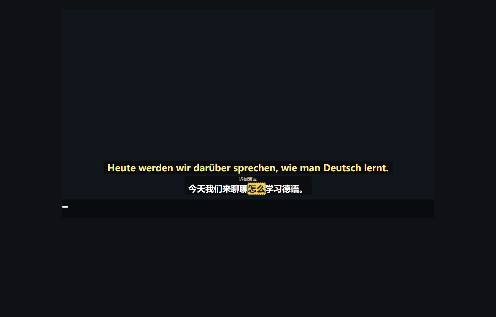

# Bilibili dual subtitles

This page describes the Bilibili part of YT Dual Subs: what it does, what it
deliberately does not do, how to use it, and what each message in the popup
means.

The short version: on a **Bilibili video page with a readable Chinese caption
track**, the extension shows the **German translation on the top line** and the
**Chinese original on the bottom line**, both from the same caption segment and
both following the video clock.



*Actual v3.12.0 overlay, captured by `tools/verify-bilibili.mjs` on a controlled
`bilibili.com/video` page with fixed caption data. German is the top line, the
Chinese original is the bottom line, and the labelled approximate follow-along
has boxed the word being spoken. It illustrates the layout, not a measurement of
any real video.*

## Supported

| | |
| --- | --- |
| Pages | `https://www.bilibili.com/video/*` — ordinary submitted videos, single part and multi-part |
| Caption tracks | Human-written and auto-generated Chinese tracks, Simplified and Traditional |
| Languages | Chinese original → German translation |
| Layout | German above, Chinese below, in the same overlay as YouTube |
| Playback | Pause, resume, seek, playback rate, switching part, switching video, autoplay to the next part |
| Fullscreen | Web fullscreen (the player's own button) and browser fullscreen |
| Settings | The whole existing style set, saved separately from YouTube |
| Offline captions | Importing a local UTF-8 SRT file, bound to one video **and part** |

## Not supported

The extension does **not** claim to support Bilibili as a whole. These are out
of scope and are not planned for this version:

- **Bilibili Live** (`live.bilibili.com`) and any live player.
- **Bangumi, movies and other player systems** (`/bangumi/play/*` and similar),
  which use a different player and a different caption path.
- **Mobile web and the mobile app.**
- **Videos with no readable caption track** *and no local recognizer running.*
  Visible Chinese burned into the picture is *not* a caption track. Use
  [subtitle-file import](#importing-a-local-subtitle-file) instead, or start
  speech recognition below; the extension does not read text out of the picture.
- **Optical character recognition** of burned-in subtitles, and any promise to
  remove such text.
- **German dubbing or audio replacement.** The German is a text translation; the
  video's own audio is never touched, and it stays audible while recognition
  captures it.
- **Speech recognition without the Deutsch Overlay desktop program.** The
  extension itself never calls a cloud service and never uploads audio: the
  captured sound goes to a local bridge on `127.0.0.1` that runs the same local
  models the desktop program already has. With no bridge running, the button
  reports that it cannot reach it and nothing is captured.

## Speech recognition for videos without captions

When a video has no caption track at all, the popup offers **启用语音识别**. The
capture is the current tab only (Bilibili Live is still out of scope), it starts
only on an explicit click, and it runs through an offscreen document so closing
the popup does not end the recording.

- The recognition gate is strict: a readable track, a track that failed to
  load, an unloaded page or an unknown state all block the start. A second copy
  of subtitles the user already has is worse than no recognition at all.
- The captions a video gets this way are the same German-above-Chinese cues as
  a page track, and the popup labels them **语音识别** — never the uploader's
  captions.
- The Chinese word times the model reports are sentence/word times for the
  Chinese original; they are **not** used to highlight German word by word.
- Nothing is stored on disk by default. Stopping the capture, leaving the video
  or closing the tab ends the session and drops the text.

## How the captions are read

Bilibili has no equivalent of YouTube's translated-caption-track endpoint, so
the two platforms reach the same overlay from different places.

- `bilibili-page.js` runs in the page's own JavaScript world. It **reuses what
  the player already fetched**: the subtitle list the page received with the
  video, and the caption file the player downloads when captions are on. It
  watches the player's own requests rather than inventing its own.
- When the player has not exposed a usable list, the reader asks the ordinary
  public metadata endpoint (`/x/player/wbi/v2`) with the page's normal session —
  the same request the page would make. **It never reads, copies or exports
  cookies**, and it adds no logic to get around a login, a membership level or
  an access restriction.
- The reader converts the caption file into the extension's cue format
  (`{ start, dur, text }` in **milliseconds**), drops empty and invalid entries,
  keeps the wording and punctuation, and never invents word times.
- Track choice follows the same rules as the rest of the extension: a track you
  picked yourself wins, then a human-written Chinese track, then an
  auto-generated Chinese one. Both the language id and the metadata are used —
  a track name alone never decides.
- The video identity **includes the part**. Different parts of the same video
  never share captions or cache entries.

Because a content script cannot read page variables, the reader and the overlay
live in different worlds and speak through `postMessage`, exactly as the YouTube
path already does. Messages are checked for their source window, type, video
identity, request generation and caption shape before they are used, and caption
text is always rendered as text, never as HTML.

## Settings are separate from YouTube

Bilibili's target language and line order are stored under their own keys, so
changing Bilibili to German leaves your YouTube setting exactly as it was, and
the other way round.

| | YouTube default | Bilibili default |
| --- | --- | --- |
| Target language | your existing choice | **German (`de`)** |
| Line order | original on top | **translation (German) on top** |

The extension's **Fast display** mode uses YouTube's translated caption track.
Bilibili has no such track, so on Bilibili the translation always goes through
the same Google text translation the extension already uses for its other modes.
No new provider, no API key and no paid service is involved.

## Reading the overlay

The top line is always the **German translation** and the bottom line is always
the **Chinese original**. The position never changes what a line *is*: copying,
exporting and the word-lookup card keep that direction, so a word on the German
line is looked up German → Chinese.

Chinese is the language actually being spoken, so the follow-along highlight
runs on the **Chinese line**. Bilibili caption files carry sentence times, not
word times, so the highlight is the **approximate** one and the video labels it
as such (`近似跟读` / *Approximate follow-along*). Chinese is segmented by word,
not by spaces. The German line is shown as a whole segment and is never given a
word-by-word highlight pretending to be German speech timing — the two languages
order their words differently, so such a mapping would be fabricated.

## When there is no caption to show

The popup reports the actual state instead of an endless spinner:

| Message | Meaning | What to do |
| --- | --- | --- |
| 正在读取中文字幕… | Still reading | Wait; the reader retries a few times and then stops. |
| 当前页面不是 B 站普通视频播放页。 | Live, bangumi or another player system | Not supported; see above. |
| 该视频没有中文字幕轨，可改为导入 SRT 字幕文件。 | No Chinese caption track exists | Import a subtitle file, or start speech recognition. |
| 该视频有字幕，但没有中文字幕轨。 | Captions exist, but none is Chinese | Not usable for Chinese → German. |
| B 站只向已登录的用户提供该视频的字幕，请先登录 B 站并刷新页面。 | The site offers the track only to a signed-in viewer | Sign in to Bilibili in this browser, then refresh the page. |
| 中文字幕读取失败。 | The caption request failed | Retry, or import a subtitle file. |
| 此视频与分 P 还没有导入的字幕文件。 | A bound file was expected but is gone | Import it again. |
| 另一个标签页正在识别，请先在那里停止。 | A capture is already running for another tab | Stop it there, or use that tab. |

The overlay also keeps the Chinese original visible when a translation is slow
or fails. It never shows the previous sentence's German while the current one is
still being translated.

## Importing a local subtitle file

If a video has no readable Chinese track — or you simply prefer your own
subtitles — you can import a UTF-8 `.srt` file from the popup's **哔哩哔哩** card.

- The file is bound to the **current video and part**. Switching to another part
  shows that part's own captions; importing again simply replaces the file.
- Use **解除绑定** to unbind it and go back to the page's own captions.
- The Chinese text is kept as the original line and translated to German as
  usual, so the top line is still German.
- The time offset control in the layout settings shifts the imported subtitles
  the same way it shifts page captions.
- Imported files are kept in the browser's **local** extension storage on this
  computer. The file itself is never uploaded anywhere. What *is* sent to the
  translation service is the text of the segments being translated — see
  [PRIVACY.md](PRIVACY.md).

A file is rejected if it is empty, larger than 2 MB, or contains no usable
timed cue.

## Privacy

Caption and subtitle text of the segments being translated is sent to Google's
translation endpoint, which is the provider the extension already uses on
YouTube; this is unchanged. The Bilibili reader uses the page's ordinary
session for the site's own public endpoints and never extracts or exports
cookies. Imported subtitle files stay on your computer.

## Troubleshooting

**The overlay is empty on a video whose picture clearly shows Chinese.**
Burned-in text is not a caption track. Open the player's caption menu: if there
is no Chinese entry, the video has no readable track. Import an SRT file.

**It worked yesterday and asks me to sign in today.**
Bilibili serves some caption tracks only to signed-in viewers. Sign in and
refresh; the reader does not work around that restriction.

**The German line is missing but the Chinese is there.**
Translation is still in flight or the provider refused it. The Chinese stays
visible on purpose. Check the popup's translation state; the extension keeps the
current sentence's translation running even while the video is paused.

**The German is one sentence behind.**
It should not be. Switching part, video or target language cancels the old work
and its answers are rejected, so a stale translation cannot overwrite a new
segment. If you can reproduce it, please [report it](https://github.com/aolingge/yt-dual-subs/issues)
with the video link and the part number.

**Subtitles sit in the wrong place, or the control bar covers them.**
Drag the box, or use the layout settings. The overlay's empty areas do not
intercept player clicks, and the danmaku switch, progress bar and player buttons
are left alone.

**Nothing appears at all after turning the extension on.**
Reload the page once. The extension reads captions from the moment the page
starts, and a page that was already open before the extension was reloaded keeps
its old content script.

## Verification

The Bilibili path is covered by the project's automated tests plus a browser
check that runs in a **separate** Edge with its own throwaway profile, so it
never touches the browser you are working in:

```sh
node --test tests/bilibili.test.cjs tests/srt-import.test.cjs
node tools/verify-bilibili.mjs      # needs Edge; writes tools/verify-bilibili-report.json
```

`tools/verify-bilibili.mjs` reports two runs separately: a real Bilibili video,
and a controlled `bilibili.com/video` page whose network answers are supplied so
the whole pipeline can be checked with fixed data. Only the extension is real in
the second run — it says nothing about live caption availability. See the
release notes for the recorded results.
